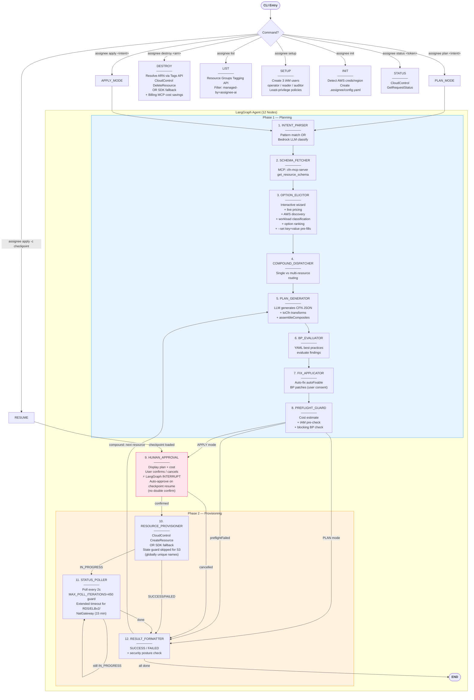
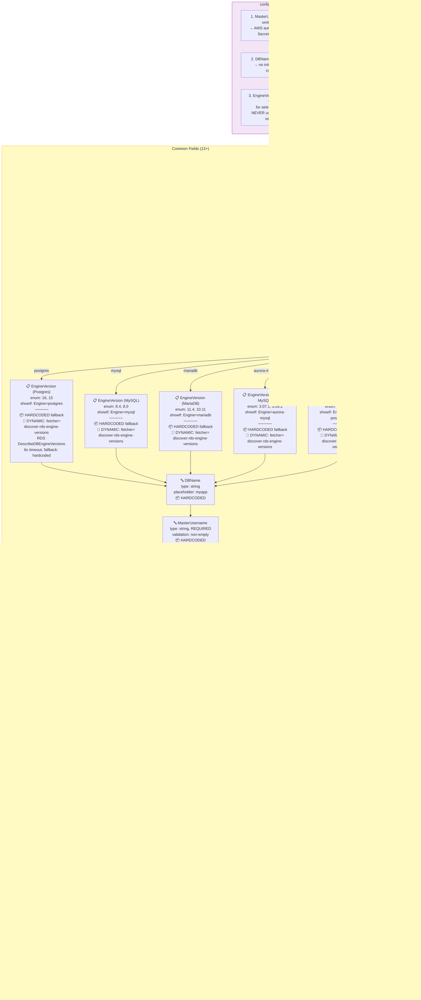
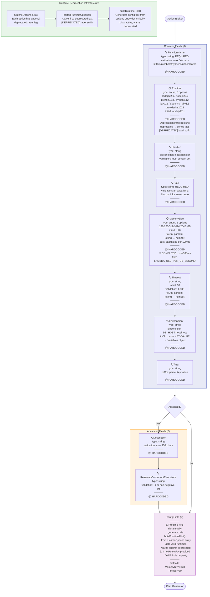
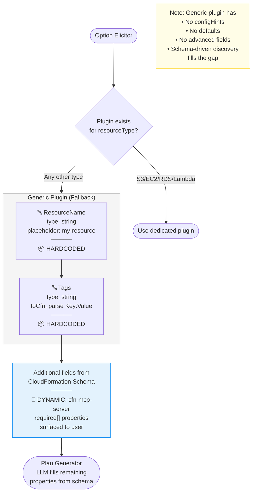
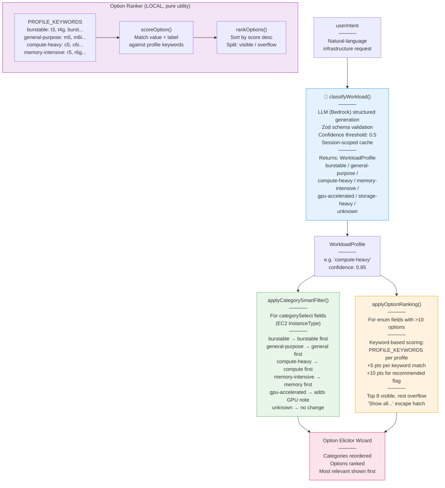

# Assignee.ai — Architecture & Flow Diagrams

> **Developer-facing diagrams.** For the authoritative CLI implementation spec, see [`cli-architecture.md`](../../_bmad-output/planning-artifacts/cli-architecture.md). For the full SaaS vision (deferred), see [`architecture.md`](../../_bmad-output/planning-artifacts/architecture.md).

Complete reference of all execution flows, resource types, MCP integrations, and data sources.

---

## 1. Main Graph Flow (All Commands)

---

## 2. MCP Servers & Data Sources

```mermaid
flowchart LR
    subgraph CORE["Core MCP Servers (Required)"]
        direction TB
        CFN["☁️ cfn-mcp-server<br/>uvx awslabs.cfn-mcp-server<br/>—————<br/>Creds: READER<br/>Region: us-east-1"]
        PRICING["💰 aws-pricing-mcp-server<br/>uvx awslabs.aws-pricing-mcp-server<br/>—————<br/>Creds: READER<br/>Region: us-east-1"]
        DOCS["📖 aws-documentation-mcp-server<br/>uvx awslabs.aws-documentation-mcp-server<br/>—————<br/>Creds: None (public)"]
        KNOW["🧠 aws-knowledge-mcp-server<br/>fastmcp remote API<br/>—————<br/>Creds: None (public)"]
    end

    subgraph OPT["Optional MCP Servers (Graceful Degrade)"]
        direction TB
        IAM["🔐 iam-mcp-server<br/>uvx --readonly<br/>—————<br/>Creds: AUDITOR"]
        SEC["🛡️ well-architected-security<br/>uvx awslabs server<br/>—————<br/>Creds: AUDITOR"]
        BILL["📊 cost-management-mcp-server<br/>uvx awslabs server<br/>—————<br/>Creds: READER"]
    end

    subgraph NODES["Graph Nodes Consuming MCP"]
        SF2["schema_fetcher"]
        OE2["option_elicitor"]
        PF2["preflight_guard"]
        RF2["result_formatter"]
        DS2["destroy cmd"]
    end

    CFN -->|"get_resource_schema"| SF2
    PRICING -->|"get_pricing"| OE2
    PRICING -->|"get_pricing"| PF2
    DOCS -->|"search_documentation<br/>read_sections"| OE2
    IAM -->|"simulate_principal_policy"| PF2
    SEC -->|"AnalyzeSecurityPosture"| RF2
    BILL -->|"get_cost_and_usage"| DS2

    subgraph SDK["Direct AWS SDK Calls"]
        direction TB
        EC2["EC2 API<br/>DescribeInstanceTypes<br/>DescribeSubnets<br/>DescribeSecurityGroups<br/>DescribeKeyPairs<br/>DescribeImages<br/>(Creds: READER)"]
        SSM["SSM API<br/>GetParameter<br/>(AMI discovery +<br/>OS name resolution)<br/>(Creds: READER)"]
        RDS["RDS API<br/>DescribeDBEngineVersions<br/>DescribeOrderableDB-<br/>InstanceOptions<br/>(Creds: READER)"]
        CC["CloudControl API<br/>CreateResource<br/>DeleteResource<br/>GetRequestStatus<br/>(Creds: OPERATOR)"]
        TAGS["Resource Groups<br/>Tagging API<br/>GetResources<br/>(Creds: OPERATOR)"]
        STS["STS API<br/>GetCallerIdentity<br/>(Creds: OPERATOR)"]
        BEDROCK["Bedrock API<br/>InvokeModel<br/>(LLM: intent parsing,<br/>workload classification)<br/>(Creds: OPERATOR)"]
    end

    EC2 -->|"dynamic options<br/>+ AMI search"| OE2
    SSM -->|"AMI lookup<br/>+ OS name resolve"| OE2
    RDS -->|"engine versions<br/>+ instance classes"| OE2
    CC -->|"provisioning"| RP2["resource_provisioner"]
    TAGS -->|"list/resolve"| LIST2["list / destroy"]
    BEDROCK -->|"workload classify"| OE2

    subgraph LOCAL["Hardcoded / Embedded"]
        direction TB
        PLUGINS["Resource Plugins<br/>5 plugins × fields<br/>Labels, hints, validators<br/>toCfn transforms"]
        BPYAML["Best Practices<br/>YAML rules<br/>Severity + remediation"]
        PATTERNS["Intent Patterns<br/>Regex matchers<br/>Zero-latency shortcut"]
        LOCALP["Local Pricing Registry<br/>Fallback estimates"]
        RANKER["Option Ranker<br/>Keyword-based scoring<br/>Profile → ranked options<br/>(LOCAL, pure utility)"]
    end

    PLUGINS -->|"field definitions"| OE2
    BPYAML -->|"evaluate rules"| BP2["bp_evaluator"]
    PATTERNS -->|"pattern match"| IP2["intent_parser"]
    LOCALP -->|"fallback pricing"| PF2
    RANKER -->|"rank + filter"| OE2

    style CORE fill:#e8f5e9,stroke:#4CAF50
    style OPT fill:#fff3e0,stroke:#FF9800
    style SDK fill:#e3f2fd,stroke:#2196F3
    style LOCAL fill:#f3e5f5,stroke:#9C27B0
```

---

## 3. AWS::S3::Bucket — Wizard Flow

```mermaid
flowchart TD
    START([Option Elicitor]) --> Q1

    subgraph COMMON["Common Fields (6)"]
        Q1["🔤 BucketName<br/>type: string<br/>placeholder: my-bucket<br/>validation: 3-63 chars, lowercase<br/>─────<br/>📦 HARDCODED"]
        Q2["✅ BucketEncryption<br/>type: boolean<br/>initial: true<br/>hint: SSE-S3 free, KMS (live pricing)<br/>─────<br/>📦 HARDCODED"]
        Q3["🔤 KMSMasterKeyID<br/>type: string<br/>showIf: BucketEncryption=true<br/>validation: arn:aws:kms:...<br/>─────<br/>📦 HARDCODED"]
        Q4["✅ PublicAccessBlockConfiguration<br/>type: boolean<br/>initial: true<br/>toCfn: BlockPublicAcls etc.<br/>─────<br/>📦 HARDCODED<br/>Default: BlockPublicAcls=true,<br/>BlockPublicPolicy=true,<br/>IgnorePublicAcls=true,<br/>RestrictPublicBuckets=true"]
        Q5["✅ VersioningConfiguration<br/>type: boolean<br/>initial: false<br/>toCfn: Status=Enabled<br/>─────<br/>📦 HARDCODED"]
        Q6["🔤 Tags<br/>type: string<br/>placeholder: env:production<br/>toCfn: parse Key:Value pairs<br/>─────<br/>📦 HARDCODED"]
    end

    Q1 --> Q2 --> Q2D{Encryption?}
    Q2D -->|true| Q3
    Q2D -->|false| Q4
    Q3 --> Q4 --> Q5 --> Q6

    Q6 --> ADV{Advanced?}

    subgraph ADVANCED["Advanced Fields (8)"]
        A1["✅ EnableLifecycle<br/>type: boolean, initial: false<br/>─────<br/>📦 HARDCODED"]
        A2["📋 LifecycleTransitionDays<br/>type: enum: 30/60/90/180<br/>showIf: EnableLifecycle=true<br/>─────<br/>📦 HARDCODED"]
        A3["🔤 LifecycleExpirationDays<br/>type: string<br/>showIf: EnableLifecycle=true<br/>validation: rejects ≤30d at prompt<br/>─────<br/>📦 HARDCODED"]
        A4["✅ EnableCors<br/>type: boolean, initial: false<br/>─────<br/>📦 HARDCODED"]
        A5["🔤 CorsAllowedOrigins<br/>type: string<br/>showIf: EnableCors=true<br/>─────<br/>📦 HARDCODED"]
        A6["📋 CorsAllowedMethods<br/>type: enum: GET / GET,PUT / All<br/>showIf: EnableCors=true<br/>─────<br/>📦 HARDCODED"]
        A7["✅ EnableReplication<br/>type: boolean, initial: false<br/>showIf: VersioningConfiguration=true<br/>─────<br/>📦 HARDCODED<br/>Skipped without IAM Role<br/>(warns instead of invalid CFN)"]
        A8["🔤 ReplicationDestinationBucket<br/>type: string, arn:aws:s3:::<br/>showIf: EnableReplication=true<br/>─────<br/>📦 HARDCODED"]
    end

    ADV -->|yes| A1
    ADV -->|no| TOCFN

    A1 --> A1D{Lifecycle?}
    A1D -->|true| A2 --> A3 --> A4
    A1D -->|false| A4

    A4 --> A4D{CORS?}
    A4D -->|true| A5 --> A6 --> A7
    A4D -->|false| A7

    A7 --> A7D{Replication?}
    A7D -->|true| A8 --> TOCFN
    A7D -->|false| TOCFN

    TOCFN["applyToCfnTransforms<br/>+ assembleS3Composites<br/>─────<br/>BucketEncryption true → CFN object<br/>false booleans → omitted<br/>Tags → Key/Value array<br/>Composite assembly:<br/>Lifecycle (Id: assignee-default-lifecycle,<br/>clamp: expiration > transition + warn),<br/>CORS (AllowedHeaders: ★),<br/>Replication (skipped w/o IAM Role),<br/>OwnershipControls (BP-S3-008<br/>BucketOwnerEnforced auto-fix)"]

    TOCFN --> PG([Plan Generator])

    style COMMON fill:#e8f5e9,stroke:#4CAF50
    style ADVANCED fill:#fff3e0,stroke:#FF9800
    style TOCFN fill:#f3e5f5,stroke:#9C27B0
```

---

## 4. AWS::EC2::Instance — Wizard Flow

```mermaid
flowchart TD
    START([Option Elicitor]) --> CLASSIFY

    CLASSIFY["🧠 classifyWorkload<br/>—————<br/>LLM (Bedrock) classifies<br/>user intent into<br/>WorkloadProfile:<br/>burstable / general-purpose /<br/>compute-heavy / memory-intensive /<br/>gpu-accelerated / storage-heavy /<br/>unknown"]

    CLASSIFY --> FILTER

    FILTER["applyCategorySmartFilter<br/>—————<br/>Reorders EC2 categories<br/>so matching profile<br/>appears first<br/>+ applyOptionRanking<br/>for enum fields >10 options"]

    FILTER --> Q1

    subgraph COMMON["Common Fields (6)"]
        Q1["📋 InstanceType<br/>type: categorySelect<br/>4 categories, 28 types<br/>initial: t3.micro<br/>─────<br/>📦 HARDCODED categories<br/>🔄 DYNAMIC: DescribeInstanceTypes<br/>fetches current-gen types<br/>💰 DYNAMIC: Pricing MCP<br/>fetches live $/hr per type<br/>🧠 Smart-filtered by<br/>workload profile"]
        Q2["📋 ImageId / AMI<br/>type: enum<br/>Static OS fallback options:<br/>amazon-linux-2023 / ubuntu-24.04 /<br/>ubuntu-22.04 / windows-2022<br/>initial: amazon-linux-2023<br/>─────<br/>🔄 DYNAMIC: fetcher=discover-amis<br/>SSM GetParameter + DescribeImages<br/>6s timeout, fallback: static OS list<br/>🔍 searchAmis() for 'Other' flow<br/>resolveAmiFromOsName() at plan time"]
        Q3["📋 KeyName<br/>type: enum<br/>options: EMPTY at build<br/>─────<br/>🔄 DYNAMIC: fetcher=discover-key-pairs<br/>EC2 DescribeKeyPairs<br/>6s timeout, fallback: manual"]
        Q4["📋 SubnetId<br/>type: enum<br/>options: EMPTY at build<br/>─────<br/>🔄 DYNAMIC: fetcher=discover-subnets<br/>EC2 DescribeSubnets<br/>6s timeout, fallback: manual"]
        Q5["📋 SecurityGroupIds<br/>type: multi-select<br/>options: EMPTY at build<br/>─────<br/>🔄 DYNAMIC: fetcher=discover-security-groups<br/>EC2 DescribeSecurityGroups<br/>6s timeout, fallback: manual"]
        Q6["🔤 Tags<br/>type: string<br/>toCfn: parse Key:Value<br/>─────<br/>📦 HARDCODED"]
    end

    Q1 --> Q2 --> Q3 --> Q4 --> Q5 --> Q6

    Q6 --> ADV{Advanced?}

    subgraph ADVANCED["Advanced Fields (5)"]
        A1["🔤 IamInstanceProfile<br/>type: string<br/>placeholder: my-instance-profile<br/>─────<br/>📦 HARDCODED"]
        A2["📋 EbsVolumeType<br/>type: enum<br/>options: gp3 / gp2 / io1<br/>initial: gp3<br/>─────<br/>📦 HARDCODED"]
        A3["🔤 EbsVolumeSize<br/>type: string<br/>placeholder: 8<br/>initial: 8 GB<br/>validation: 1-16384 GB<br/>─────<br/>📦 HARDCODED"]
        A4["✅ EbsEncrypted<br/>type: boolean<br/>initial: true<br/>─────<br/>📦 HARDCODED"]
        A5["🔤 UserData<br/>type: string<br/>base64 script<br/>─────<br/>📦 HARDCODED"]
    end

    ADV -->|yes| A1 --> A2 --> A3 --> A4 --> A5 --> TOCFN
    ADV -->|no| TOCFN

    TOCFN["applyToCfnTransforms<br/>+ assembleEc2Storage()<br/>─────<br/>Composite assembly:<br/>EbsVolumeType + EbsVolumeSize +<br/>EbsEncrypted → BlockDeviceMappings<br/>Removes intermediate keys<br/>─────<br/>Defaults applied:<br/>MetadataOptions.HttpTokens=required<br/>BlockDeviceMappings: encrypted gp3"]

    TOCFN --> PG

    subgraph CATS["categorySelect: 4 Instance Categories"]
        C1["⚡ Burstable t3/t4g<br/>10 types<br/>(live pricing)"]
        C2["⚖️ General Purpose m5/m6i<br/>6 types<br/>(live pricing)"]
        C3["🖥️ Compute Optimized c5/c6i<br/>6 types<br/>(live pricing)"]
        C4["🧠 Memory Optimized r5/r6i<br/>6 types<br/>(live pricing)"]
    end

    Q1 -.->|"user picks category"| CATS

    subgraph FETCH["Runtime Discovery (6s timeout each)"]
        F1["EC2 DescribeInstanceTypes<br/>current-generation=true<br/>grouped by family"]
        F2["SSM /aws/service/ami-*<br/>+ EC2 DescribeImages"]
        F3["EC2 DescribeKeyPairs"]
        F4["EC2 DescribeSubnets"]
        F5["EC2 DescribeSecurityGroups"]
    end

    subgraph AMI_FLOWS["ImageId Resolution Flows"]
        AMI1["discover-amis fetcher<br/>→ SSM + DescribeImages<br/>→ real AMI IDs"]
        AMI2["Static OS fallback<br/>→ amazon-linux-2023 etc.<br/>→ resolveAmiFromOsName()<br/>via SSM GetParameter<br/>at plan generation time"]
        AMI3["'Other' selection<br/>→ searchAmis()<br/>via EC2 DescribeImages<br/>name filter, top 5 results"]
    end

    subgraph HINTS["configHints (7)"]
        H1["1. ImageId REQUIRED,<br/>OS names kept as-is"]
        H2["2. KeyName: omit if empty"]
        H3["3. SubnetId: omit if empty"]
        H4["4. SecurityGroupIds: omit if empty"]
        H5["5. IamInstanceProfile: omit if empty"]
        H6["6. IMDSv2: ALWAYS include<br/>HttpTokens=required"]
        H7["7. EBS: ALWAYS include<br/>Encrypted=true, VolumeType=gp3"]
    end

    PG([Plan Generator])

    style COMMON fill:#e3f2fd,stroke:#2196F3
    style ADVANCED fill:#fff3e0,stroke:#FF9800
    style CATS fill:#fce4ec,stroke:#E91E63
    style FETCH fill:#e8f5e9,stroke:#4CAF50
    style AMI_FLOWS fill:#f3e5f5,stroke:#9C27B0
    style HINTS fill:#fffde7,stroke:#FDD835
    style TOCFN fill:#f3e5f5,stroke:#9C27B0
```

---

## 5. AWS::RDS::DBInstance — Wizard Flow

---

## 6. AWS::Lambda::Function — Wizard Flow

---

## 7. Generic Resource (Fallback) — Wizard Flow

---

## 8. 3-User Credential Model & MCP Routing

```mermaid
flowchart TB
    subgraph CREDS["3 IAM User Classes (Least Privilege)"]
        direction LR
        OP["🔧 OPERATOR<br/>ASSIGNEE_OPERATOR_*<br/>─────<br/>Bedrock InvokeModel<br/>CloudControl CRUD<br/>Resource provisioning<br/>ec2:TerminateInstances"]
        RD["📖 READER<br/>ASSIGNEE_READER_*<br/>─────<br/>CFN Schema registry<br/>Pricing API<br/>Cost Explorer<br/>ec2:Describe*<br/>ssm:GetParameter<br/>rds:Describe*"]
        AU["🔐 AUDITOR<br/>ASSIGNEE_AUDITOR_*<br/>─────<br/>IAM SimulatePolicy<br/>SecurityHub<br/>GuardDuty<br/>Inspector<br/>Access Analyzer"]
    end

    subgraph CORE_MCP["Core MCP Servers"]
        CFN["cfn-mcp-server"]
        PRICE["aws-pricing-mcp-server"]
        DOCS["aws-documentation-mcp-server<br/>(no creds needed)"]
        KNOW["aws-knowledge-mcp-server<br/>(no creds needed)"]
    end

    subgraph OPT_MCP["Optional MCP Servers"]
        IAM_S["iam-mcp-server --readonly"]
        SEC_S["well-architected-security"]
        BILL_S["cost-management-mcp-server"]
    end

    subgraph DIRECT["Direct AWS SDK Calls"]
        BED["Bedrock<br/>InvokeModel<br/>(LLM calls +<br/>workload classify)"]
        CC["CloudControl<br/>Create/Delete/Get"]
        EC2D["EC2<br/>Describe*<br/>(discovery +<br/>AMI search)"]
        SSMD["SSM<br/>GetParameter<br/>(AMI lookup +<br/>OS resolution)"]
        RDSD["RDS<br/>DescribeDBEngineVersions<br/>DescribeOrderableDB-<br/>InstanceOptions"]
        STSD["STS<br/>GetCallerIdentity"]
        TAGD["ResourceGroups<br/>Tagging API"]
        IAMD["IAM<br/>Create/Attach<br/>(setup only)"]
    end

    RD -->|"AWS_* env mapped"| CFN
    RD -->|"AWS_* env mapped"| PRICE
    RD -->|"AWS_* env mapped"| BILL_S
    RD --> EC2D
    RD --> SSMD
    RD --> RDSD
    AU -->|"AWS_* env mapped"| IAM_S
    AU -->|"AWS_* env mapped"| SEC_S

    OP --> BED
    OP --> CC
    OP --> STSD
    OP --> TAGD
    OP --> IAMD

    subgraph NODES["Graph Nodes"]
        N_IP["intent_parser"]
        N_SF["schema_fetcher"]
        N_OE["option_elicitor"]
        N_PF["preflight_guard"]
        N_RP["resource_provisioner"]
        N_RF["result_formatter"]
    end

    BED --> N_IP
    BED --> N_OE
    BED --> N_PF
    CFN --> N_SF
    PRICE --> N_OE
    PRICE --> N_PF
    EC2D --> N_OE
    SSMD --> N_OE
    RDSD --> N_OE
    IAM_S --> N_PF
    CC --> N_RP
    SEC_S --> N_RF

    style CREDS fill:#e8f5e9,stroke:#4CAF50
    style CORE_MCP fill:#e3f2fd,stroke:#2196F3
    style OPT_MCP fill:#fff3e0,stroke:#FF9800
    style DIRECT fill:#fce4ec,stroke:#E91E63
    style NODES fill:#f5f5f5,stroke:#9E9E9E
```

---

## 9. Assignee MCP Server — Exposed to External AI Agents

---

## 10. Intent-Aware Filtering Pipeline

---

## Data Source Legend

| Symbol                  | Meaning                                              |
| ----------------------- | ---------------------------------------------------- |
| 📦 HARDCODED            | Defined statically in plugin source code             |
| 🔄 DYNAMIC              | Fetched at runtime from AWS API or MCP server        |
| 🔄 DYNAMIC: fetcher     | Fetched via named fetcher function at wizard time    |
| 🔍 DYNAMIC: searchAmis  | Searched via ec2:DescribeImages (name filter, top 5) |
| 🔄 DYNAMIC: resolveAmi  | Resolved via SSM GetParameter (OS name → AMI ID)     |
| 💰 DYNAMIC: Pricing MCP | Live price from aws-pricing-mcp-server               |
| 🧮 COMPUTED             | Calculated from constants at build time              |
| 📋 enum                 | Fixed dropdown options                               |
| ✅ boolean              | Yes/No toggle                                        |
| 🔤 string               | Free text input                                      |

## Timeout & Fallback Summary

| Source                            | Timeout | Fallback                      |
| --------------------------------- | ------- | ----------------------------- |
| EC2 Describe\* (discovery)        | 6s      | Manual string entry           |
| SSM AMI lookup (discover-amis)    | 6s      | Static OS name fallback list  |
| AMI search (DescribeImages)       | 6s      | LLM suggestion                |
| AMI resolution (SSM GetParameter) | 6s      | Plan fails with clear error   |
| RDS engine versions               | 6s      | Hardcoded version list        |
| RDS instance classes              | 6s      | Hardcoded class list          |
| Pricing MCP (option_elicitor)     | 6s      | Static cost hints in labels   |
| Pricing MCP (preflight_guard)     | 3s      | Local pricing registry        |
| IAM simulation                    | 3s      | Assume allowed                |
| Security posture                  | 5s      | Skip findings                 |
| Billing MCP (destroy)             | 3s      | Provision log memory or "N/A" |
